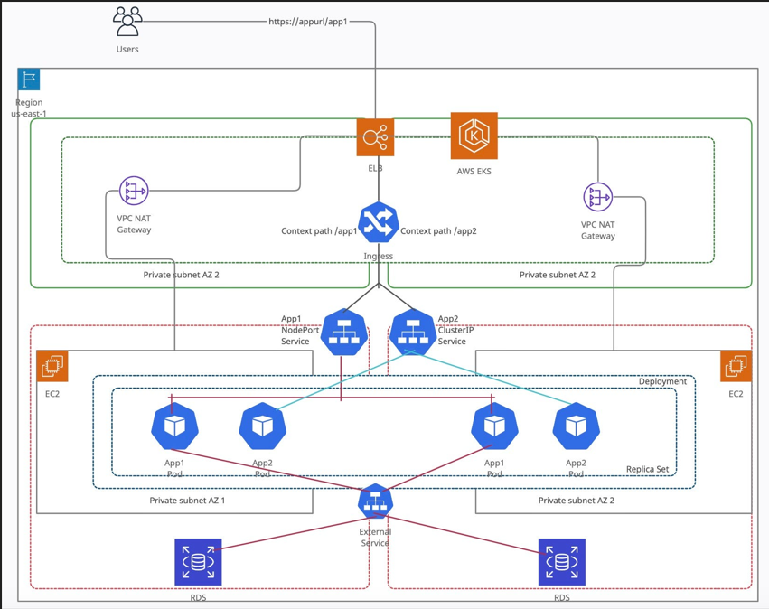

# Prophisous Project

This project, comprise of an EKS cluster and RDS MySQL Database deployed on AWS incorporated with AWS networking best practices and security practices when deploying this. The project performs the entire process using Terraform to automate the process of creating the resources. 



The image above is a perfect representation of the architecture and process I used when deploying the architecture. The application is a simple CRUD application written in JAVA. The CRUD activities is being performed on the MySQL database. 

To deploy this application, ensure that you have AWS CLI and Terraform installed on the host machine. Follow the steps below to deploy the application.
1. Update your server and create a working directory. Pls note we will be deploying this application on ubuntu server

```
sudo apt update -y
mkdir Project
cd Project
```

2. Initialize git in the working directory and clone the repo. for

```
git init
git clone https://github.com/akurasy/Prophius-project.git
``` 


3. Initialize terraform in the working directory

```
terraform init
```

4. Apply Terraform code

```
terraform apply -auto-approve

#The previous command will create the eks cluster and the msql database. Next is to push an image to the ECR repository created. The url is in the terraform outputs
```


5. Install Docker and make ubuntu user docker owner. pls note this docker installation is for Ubuntu server 

```
sudo apt update
sudo apt install -y apt-transport-https ca-certificates curl software-properties-common
curl -fsSL https://download.docker.com/linux/ubuntu/gpg | sudo gpg --dearmor -o /usr/share/keyrings/docker-archive-keyring.gpg
echo "deb [arch=amd64 signed-by=/usr/share/keyrings/docker-archive-keyring.gpg] https://download.docker.com/linux/ubuntu $(lsb_release -cs) stable" | sudo tee /etc/apt/sources.list.d/docker.list > /dev/null
echo "deb [arch=arm64 signed-by=/usr/share/keyrings/docker-archive-keyring.gpg] https://download.docker.com/linux/ubuntu $(lsb_release -cs) stable" | sudo tee /etc/apt/sources.list.d/docker.list > /dev/null
sudo apt update
sudo apt install -y docker-ce docker-ce-cli containerd.io
sudo systemctl start docker
sudo systemctl enable docker
sudo usermod -aG docker ubuntu
sudo su - ubuntu

# build the image
docker build -t prophius-project-image .
```

6. Authenticate Docker to your ECR repository: run the command below

```

# aws ecr get-login-password --region <your-region> | docker login --username AWS --password-stdin <your-account-id>.dkr.ecr.<your-region>.amazonaws.com

aws ecr get-login-password --region us-west-2 | docker login --username AWS --password-stdin 166937434313.dkr.ecr.us-west-1.amazonaws.com

# Pls edit with desired aws region and account ID.s
```

7. Tag your docker image

```
#docker tag <your-image-name> <your-account-id>.dkr.ecr.<your-region>.amazonaws.com/<your-ecr-repository>:<your-tag>

docker tag prophius-project-image 166937434313.dkr.ecr.us-west-2.amazonaws.com/Prophius-Project-image:latest
```

8. Push the built docker image to amazon ECR. Pls note this ECR has been created with terraform

```
# docker push <your-account-id>.dkr.ecr.<your-region>.amazonaws.com/<your-ecr-repository>:<your-tag>

docker push 166937434313.dkr.ecr.us-west-2.amazonaws.com/Prophius-Project-image:latest
```


9. Configure kubectl 

```
aws eks --region us-west-2 update-kubeconfig --name Prophious-Project
```

10. Apply the applications configuration and pods

```

# Before you apply the application, Pls edit the deployment yaml file (sprinboot.yaml) to the appropriate image name. # Under the spec parameters for the pod, edit the image which is a child of containers to the appropriate image name copied from the ECR repository. 

#goto AWS console, under ecr and copy the image name
#edit the springboot.yaml file and under the spec for the pod, goto containers and paste the image name, then run the command below:
```
```

kubectl apply -f .
```

The kubenetes archtecture creates a service account and configures a service provider created by terraform. This is needed for the pods to safely get the database password and username from the secret manager.


11. Browse the deployed application by copying the url of the eks land balancer and browse on your local machine. ensure ingress rule is enable for port 80 which uses http protocol.

```
kubectl get all -o wide

# This command gives all information about the cluster and you can copy the load balancer url and browse on your local machine.
```

12. For cleanup to destroy all created infrastructure, run the following commands


```

terraform destroy -auto-approve
kubectl delete -f .
```
